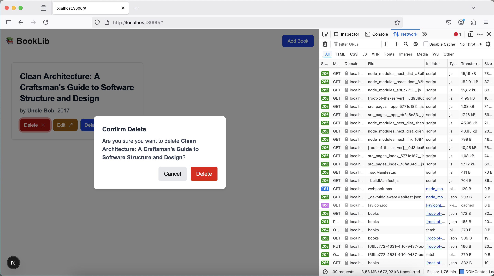

# Fullstack Book Library CRUD App

A full-fledged CRUD application to manage a small library of books, along with a URL Cleanup & Redirection Service.

## ✨ Features

### 📖 Book Library

- List all books
- Add a new book
- Edit book details
- View book details
- Delete a book
- Client-side form validation
- Modal-based forms
- Friendly error handling

### 🔗 URL Cleanup & Redirection

- Canonical: Remove query parameters and trailing slashes
- Redirection: Force domain to www.byfood.com and lowercase the entire URL
- All: Apply canonical first, then redirection
- JSON request/response format
- Backend validation and error handling

## 🔧 Tech Stack

### Frontend:

- TypeScript
- Next.js (React) with TypeScript
- Tailwind CSS for styling

### Backend:

- Golang
- RESTful API
- PostgreSQL
- Contextual Logging with `github.com/rizanw/go-log` package
- Swagger/OpenAPI for API documentation

## 🧱 Domain-Driven Design (DDD) Overview

The backend is designed using **Clean Architecture / DDD principles**.

### 📘 Domain: Book

**Entity: `Book`**

```go
type Book struct {
ID     string // UUID
Title  string
Author string
Year   int
}

```

**Business Rules**:

- Title and Author must not be empty.

## 📄 API Specification (Summary)

> for detailed API Docs, kindly check backend documentations.

### Book CRUD

| Method | Endpoint      | Description             |
|--------|---------------|-------------------------|
| GET    | `/books`      | Retrieve all books      |
| GET    | `/books/{id}` | Get a single book by ID |
| POST   | `/books`      | Add a new book          | 
| PUT    | `/books/{id}` | Update a book by ID     | 
| DELETE | `/books/{id}` | Delete a book by ID     |

### URL Processor

| Method | Endpoint       | Description                                       |
|--------|----------------|---------------------------------------------------|
| POST   | `/process-url` | Process a URL with canonical, redirection, or all |

## 🧰 Setup Instructions

To set up and run the project locally, please refer to the setup instructions inside each subdirectory:

- 📦 Backend: [backend/README.md](backend/README.md)

- 💻 Frontend: [frontend/README.md](frontend/README.md)

## 🧪 Testing and Screenshots

### Book CRUD

#### List All Books:


#### Book Detail Information:


#### Add Book Form:


#### Add Book (form validation):


#### Update Book Data:


### Delete Book with dialog confirmation:



### Book List Deleted:


###      

### URL Processor

#### Example 1:

```json
{
  "url": "https://BYFOOD.com/food-EXPeriences?query=abc/",
  "operation": "all"
}
```


#### Example 2:

```json
{
  "url": "https://BYFOOD.com/food-EXPeriences?query=abc/",
  "operation": "canonical"
}
```


## 📦 Deliverables Checklist

- [x] Backend with Book CRUD API

- [x] Backend with URL Processor API

- [x] PostgreSQL persistence

- [x] Swagger API documentation

- [x] Unit tests for backend

- [x] Local setup scripts and migration scripts

- [x] Frontend UI for Book CRUD

- [x] Frontend integration with backend

- [x] Screenshots of the working application
